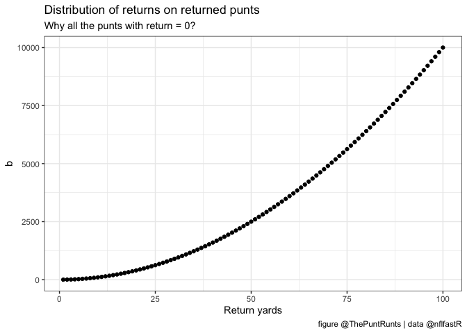

This is text

``` r
install.packages("tidyverse", repos = "http://cran.us.r-project.org")
library(tidyverse)
```

# Heading - plot time\!

Here are some plots:

``` r
df <- tibble(a = 1:100) %>%
  mutate(b = a^2)
ggplot(data=df, mapping = aes(x=a, y=b)) +
  geom_point() +
  theme_bw() +
  labs(title = "Distribution of returns on returned punts",
         subtitle = "Why all the punts with return = 0?",
         x="Return yards", caption="figure @ThePuntRunts | data @nflfastR")
```

<!-- -->
