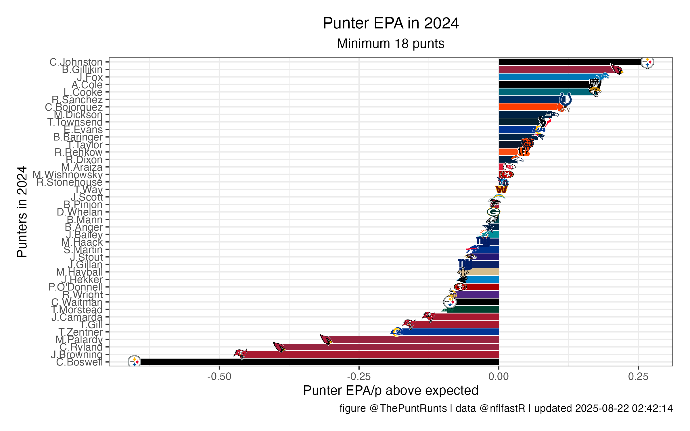

# Plots & Tables
Someday, this page might be interactive, in the style of [RBSDM](https://rbsdm.com/). In the mean time, enjoy a whole bunch of stuff to scroll through! For more details about our metrics, head [here](/metrics.md).  

### Stats this season (2021)
Here's how things stand this season; this table and the graph below will automatically update at 1 AM eastern after TNF, SNF, and MNF.


And here's just pEPA, in the familiar horizontal bar plot we're always tweeting:

### Stats from previous seasons
#### Punt Runts Custom EPA
How has your favorite punter stacked up in EPA over the years?

#### Open-Field vs. Pin-Deep performance
Is your punter a "big boot", "precision specialist", both, or neither?

